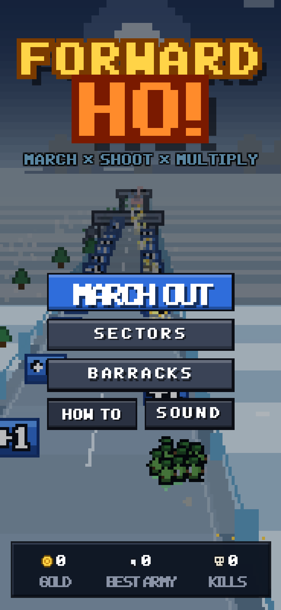
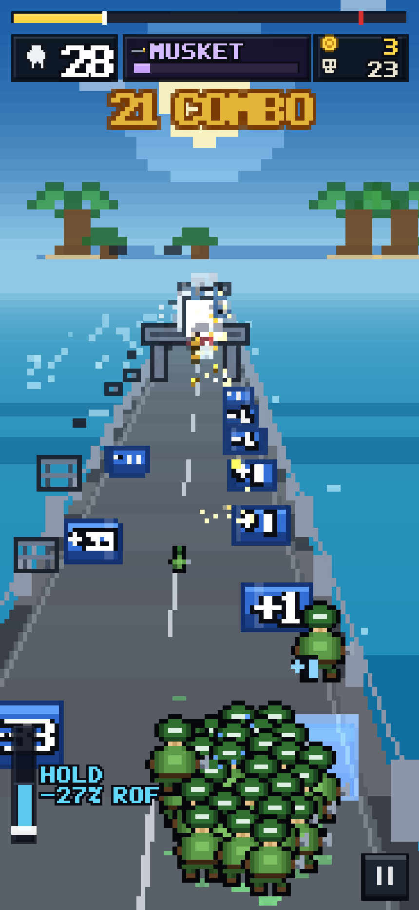
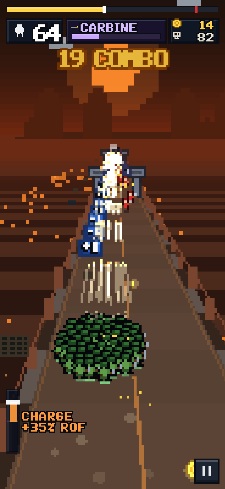
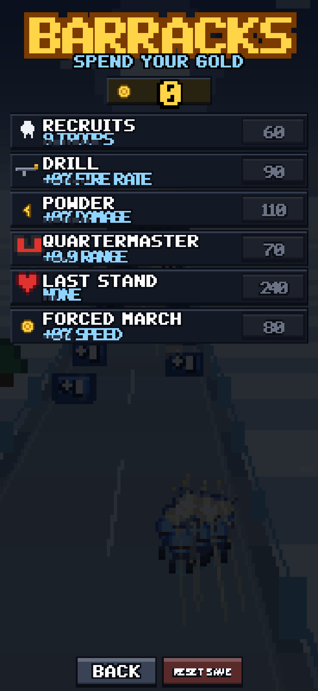

# Forward Ho!

[](https://github.com/cportka/forward-ho/actions/workflows/ci.yml)
[](https://github.com/cportka/forward-ho/actions/workflows/deploy.yml)

**▶ [Play it here](https://cportka.github.io/forward-ho/)**

A forward-scrolling crowd-runner shoot-'em-up. You command a marching column of
troops down a road that never stops. The column fires by itself; your only job
is to steer it — through the gates that grow it, into the reward boards that
arm it, and straight through the invasion coming the other way.

Everything is drawn with a hand-built pixel renderer. No sprite sheets, no
audio files, no engine — just TypeScript, a canvas, and a lot of ASCII art.




## Play

```bash
npm install
npm run dev      # http://127.0.0.1:5173
```

- **Steer** — drag anywhere, or `A`/`D`, or the arrow keys.
- **Pause** — `Esc` / `P`, or the button bottom-right.
- Your troops fire on their own. Positioning *is* the game.

`npm run build` produces a static bundle in `dist/` that can be served from
anywhere; `npm run preview` serves it locally.

## The loop

| Element | What it does |
| --- | --- |
| **`+1` ladders** | Long runs of small gates hugging a shoulder. Hug the rail and stack up troops one at a time. |
| **Choice gates** | A pair across the road — one good, one bad. `+N` and `xN` grow the army, `-N` and `/N` cut it. Penalties are capped as a share of your army, so a bad gate is a mistake, not a run-ender. |
| **Reward boards** | Big panels with a number on them. Shoot the number to zero and the panel's line-art fills up from the top; at zero it shatters and pays out a weapon tier, a block of allies, gold or a shield. Ram one instead and it costs you troops. |
| **Barricades** | Grids of crates, planks, barrels and sandbags. Blast the cells out or lose troops ploughing through them. |
| **The horde** | A carpet of bodies stretching up the road. It feeds real marchers off its near edge and visibly recedes as you grind through it. Every body that reaches your formation costs you a troop. |
| **Bosses** | They hold station ahead of you and close in on a clock, cycling stomps, charges and summons. Out-damage the countdown or get walked over. |
| **Gold & the barracks** | Coins bank between runs and buy permanent upgrades: starting troops, fire rate, damage, pickup range, a mid-run rally, and march speed. |

Six sectors — Iron Strait, Slag Works, Frost Reach, Brass Dunes, Neon Mile and
The Last Mile — each with its own sky, terrain, props and boss. Past the last
one the campaign loops with escalating difficulty. Ten weapon tiers run from a
musket to an annihilator, each with its own cadence, spread and projectile.




## How it's built

### Pixels of different sizes, on purpose

The scene is painted into six offscreen buffers, each with its own pixel size,
then composited with nearest-neighbour upscaling:

| Plane | Pixel size | Contents |
| --- | --- | --- |
| `sky` | 5 units | sky gradient, sun, clouds, stars |
| `far` | 4 units | horizon ridgelines and landmarks |
| `mid` | 3 units | the ground plane either side of the road |
| `world` | 2 units | road, trackside props, actors, lane furniture |
| `fx` | 2 units | projectiles, particles, floating text |
| `ui` | 1 unit | HUD and menus |

So the sky is built from chunky blocks, the sea is finer, the tarmac finer
still, and the HUD is crisp — the picture's pixel size steps down as your eye
travels toward the squad's boots.

On top of that, **every sprite picks its own block size**. `bakeSprite` takes a
target height in device pixels and snaps it to a ladder of integer block sizes,
baking a cached canvas at exactly that scale. When a sprite would need less than
one pixel per art pixel it drops art resolution (a mip) instead of squashing,
choosing the most common opaque colour per cell so silhouettes survive. The
result: every object on screen has perfectly square, evenly spaced pixels at
whatever size it happens to be, and a distant soldier is legitimately chunkier
than a near one — without anything snapping to a single global grid.

### The rest of it

- **Pseudo-3D** — one perspective divide (`x` lateral, `y` up, `z` forward).
  The ground is rendered as classic scanlines: for each screen row, invert the
  projection to get a depth, then paint that row's slice of terrain and road.
- **The crowd** — units sit on a phyllotaxis disc squashed along `Z`, each
  springing toward its slot so the blob sloshes when you steer. Past a cap the
  formation compresses instead of spilling off the road. Total damage scales
  with the crowd while the number of visible shooters stays bounded, so a
  400-strong army melts things without drawing 400 muzzle flashes.
- **The horde** — a field's *mass* and its *simulated marchers* are separate
  numbers. A 170-body carpet spawns ~44 real enemies and loses ~4 bodies of
  carpet per kill, which is what lets an army stretch to the horizon without
  burying the player or the frame budget.
- **Destructible HP is sized against your current DPS**, not a flat constant,
  so a board always takes about the same number of seconds to break whether
  you're nine troops with a musket or four hundred with an ion lance.
- **Audio** is fully synthesised — oscillators, one shared noise buffer,
  filters and envelopes, plus a look-ahead chiptune sequencer with four tracks
  and crossfades. No asset files anywhere in the project.
- **Levels are deterministic** — `buildLevel(index, seed)` emits a flat,
  depth-sorted list of things to place, which the world streams in as you
  approach. Same seed, same run.

### Layout

```
src/
  core/       math, seeded RNG, input, localStorage
  render/     sprite baking, layered pixel buffers, camera, font, art bank, backdrops
  game/       squad, bullets, enemies, boss, props, fx, levels, world, progression, audio
  ui/         immediate-mode widgets, HUD, screens
  dev/        sprite gallery
tools/        Playwright screenshot + smoke-test harness
```

## CI & deployment

- **`ci.yml`** — typechecks, builds, and then plays a real run in headless
  Chromium via the screenshot harness, failing on any console or page error.
  Screenshots are uploaded as an artifact on every run.
- **`deploy.yml`** — builds and publishes `dist/` to GitHub Pages on every push
  to `main`.

## Developer tools

```bash
npm run typecheck
npm run shots -- --shots 'menu@1,mid@20,boss@70'   # screenshots + smoke test
```

`tools/screenshot.mjs` boots a dev server, drives the game through
`window.__FH`, captures timed PNGs with a JSON state dump beside each, builds a
contact sheet, and exits non-zero on any console or page error. See
[tools/README.md](tools/README.md).

Open `?gallery=1` to see every sprite rendered at four sizes — the quickest way
to check that block quantisation is behaving.

The debug hook (`window.__FH`) exposes `startRun`, `setSteer`, `seed`,
`fastForward`, `screen` and `state` for scripted testing.

## Credits

Built as a homage to the mobile "army runner" genre — the marching crowd, the
multiplier gates, the shoot-the-number reward boards and the boss that walks at
you. All art, sound and code here are original.
